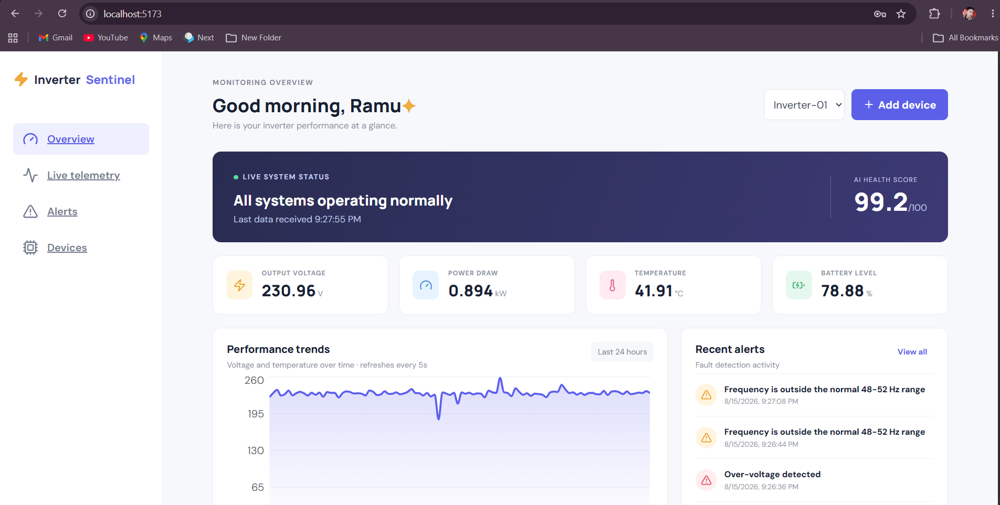
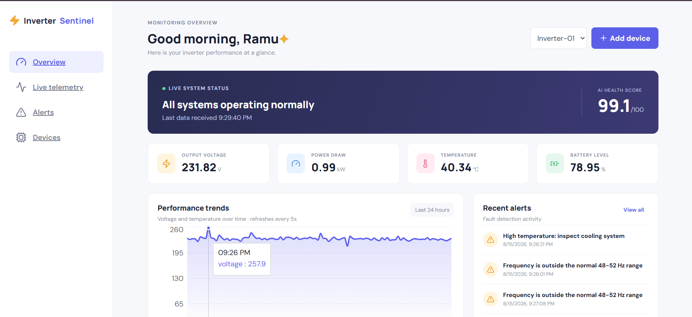
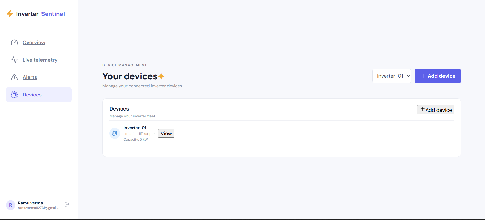
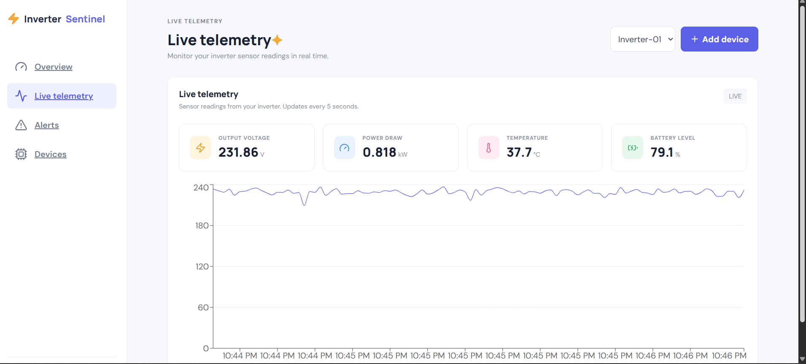
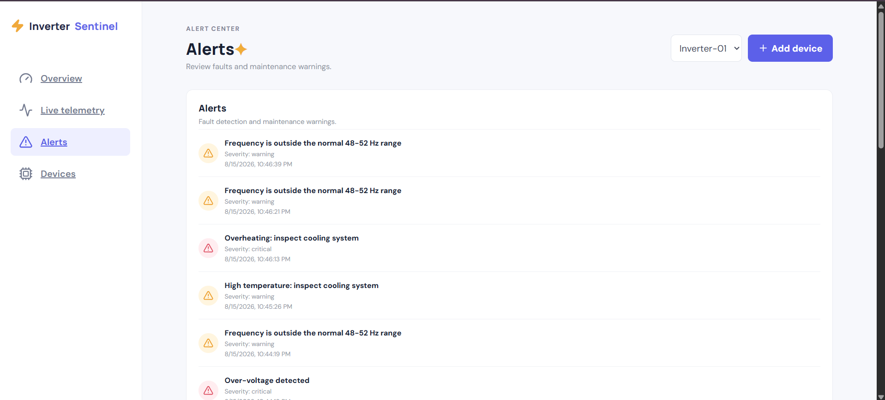

# ⚡ Smart Inverter Monitoring & Predictive Maintenance System

A full-stack monitoring and predictive-maintenance prototype for inverter systems. The application collects inverter telemetry, stores device history, checks electrical operating limits, detects unusual patterns with **Isolation Forest**, calculates an inverter **health score**, and displays the results in a React dashboard.

> **Project focus:** Electrical Engineering + Python + FastAPI + SQL/PostgreSQL + Machine Learning + React + Docker

## 🎯 What Problem Does It Solve?

Inverters can develop abnormal operating conditions such as over-voltage, high temperature, low battery level, or frequency problems. Detecting these conditions early can help reduce unexpected downtime and make maintenance more proactive.

This project continuously monitors:

- Output voltage
- Current
- Temperature
- Battery level
- Frequency
- Power

The system then:

1. Receives telemetry from a simulator or IoT device such as an ESP32.
2. Validates and stores the readings through a FastAPI backend.
3. Checks predefined electrical limits and creates alerts.
4. Uses **Isolation Forest** to detect unusual operating patterns when enough history is available.
5. Converts the latest readings and anomaly information into a **0–100 health score**.
6. Displays live telemetry, trends, devices, and alerts in a React dashboard.

> **Important:** This version performs **anomaly detection**, not exact failure-date prediction. A true failure-time prediction system would require labeled historical failure data and a supervised model.

---

## 🏗️ System Architecture

```text
        Inverter / Simulator / ESP32
                    │
                    ▼
          ┌───────────────────┐
          │   FastAPI Backend │
          │ Auth + Validation │
          └─────────┬─────────┘
                    │
          ┌─────────┴─────────┐
          ▼                   ▼
   PostgreSQL / SQL      Fault Detection
   Telemetry History     Electrical Rules
          │                   │
          └─────────┬─────────┘
                    ▼
            Isolation Forest
            Anomaly Detection
                    │
                    ▼
              Health Score
                 0–100
                    │
                    ▼
            React Web Dashboard
       ┌────────┬────────┬────────┐
       ▼        ▼        ▼        ▼
    Overview  Telemetry Alerts  Devices
```

## ✨ Main Features

- 🔐 JWT authentication
- 🔌 Device management
- 📡 Live inverter telemetry
- ⚡ Voltage/current/frequency monitoring
- 🌡️ Temperature monitoring
- 🔋 Battery-level monitoring
- 🚨 Rule-based fault alerts
- 🤖 Isolation Forest anomaly detection
- ❤️ 0–100 inverter health score
- 📈 Live and historical trend charts
- 🗄️ SQL/PostgreSQL telemetry storage
- 🧪 Pytest-based backend testing
- 🐳 Docker Compose support
- ⚛️ React frontend

## 🖥️ Screenshots

### Dashboard Overview



The overview provides the current inverter status, AI health score, voltage, power draw, temperature, battery level, performance trends, and recent alerts.

### Performance Trend & Fault Detection



The dashboard visualizes voltage behavior over time and highlights abnormal readings that can contribute to maintenance alerts.

### Device Management



The device page allows connected inverter devices to be viewed and managed.

### Live Telemetry



Live telemetry displays sensor readings and a continuously updating voltage trend.

### Alert Center



The alert center lists detected conditions such as frequency violations, overheating, high temperature, and over-voltage.

---

## 🤖 Machine Learning

The ML component uses **Isolation Forest**, an unsupervised anomaly-detection algorithm.

The model uses these features:

```text
voltage
current
temperature
battery
frequency
power
```

When enough historical samples are available, the model learns the normal operating pattern and checks whether the latest reading is unusual.

The application also calculates an explainable health score based on electrical operating conditions such as voltage, frequency, temperature, and battery level.

### Why Isolation Forest?

Real inverter failure datasets with reliable failure labels are not available in this prototype. Isolation Forest is therefore useful because it can identify unusual observations without requiring a failure label for every telemetry record.

---

## 🛠️ Technology Stack

| Layer | Technology |
|---|---|
| Frontend | React, Vite |
| Backend | Python, FastAPI |
| Database | SQLAlchemy, PostgreSQL / SQLite |
| Machine Learning | Scikit-learn, Isolation Forest |
| Data Processing | NumPy |
| Authentication | JWT |
| Testing | Pytest |
| Deployment | Docker, Docker Compose |
| API | REST + OpenAPI |

---

## 📁 Project Structure

```text
smart-inverter-predictive-maintenance/
│
├── backend/
│   ├── app/
│   │   ├── main.py
│   │   ├── ml.py
│   │   └── simulator.py
│   └── requirements.txt
│
├── frontend/
│   ├── src/
│   │   ├── main.jsx
│   │   └── ...
│   └── package.json
│
├── screenshots/
│   ├── dashboard.png
│   ├── dashboard-trend.png
│   ├── devices.png
│   ├── live-telemetry.png
│   └── alerts.png
│
├── docker-compose.yml
├── .env.example
├── .gitignore
└── README.md
```

## 🚀 Quick Start

### 1. Start the backend

```bash
cd backend
python -m venv .venv
.venv\Scripts\activate
python -m pip install -r requirements.txt
python -m uvicorn app.main:app --reload --port 8000
```

### 2. Start the frontend

Open a second terminal:

```bash
cd frontend
npm install
npm run dev
```

Open the Vite URL, normally:

```text
http://localhost:5173
```

The backend API normally runs at:

```text
http://localhost:8000
```

### 3. API Documentation

FastAPI automatically provides interactive OpenAPI documentation at:

```text
http://localhost:8000/docs
```

### 4. Docker

If Docker is configured for the project:

```bash
docker compose up --build
```

---

## 📡 Example Telemetry Payload

```json
{
  "device_id": 1,
  "voltage": 230,
  "current": 3.5,
  "temperature": 38,
  "battery": 82,
  "frequency": 50
}
```

Power can be calculated automatically by the backend when it is not supplied.

---

## 🧪 Testing

From the backend directory:

```bash
pytest -q
```

The tests cover core API behavior and ML cases such as empty history, healthy readings, abnormal conditions, and Isolation Forest activation after enough samples.

---

## 🔮 Future Improvements

- Connect a real ESP32 and inverter sensors
- Collect real historical inverter data
- Add labeled failure datasets
- Train a supervised failure-classification model
- Evaluate ML performance with precision, recall, and F1-score
- Add model versioning and saved models
- Add Alembic database migrations
- Add device/API keys for IoT devices
- Add email/SMS notifications
- Deploy the application to the cloud

---

## 💼 Placement / Resume Description

**Smart Inverter Monitoring & Predictive Maintenance | Python, FastAPI, PostgreSQL, React, Scikit-learn, Docker**

- Built a full-stack inverter monitoring system that ingests voltage, current, temperature, battery, frequency, and power telemetry through REST APIs and stores device history in SQL/PostgreSQL.
- Implemented rule-based electrical fault detection and an **Isolation Forest** anomaly-detection pipeline to identify abnormal operating patterns and generate a **0–100 inverter health score**.
- Developed a React dashboard with live telemetry, historical trends, device management, and alerts; added Docker Compose support and Pytest coverage for core backend/ML functionality.

---

## 👨‍💻 Project Goal

This project demonstrates how Electrical Engineering knowledge can be combined with modern software engineering and machine learning to build a practical monitoring system.

**Electrical Engineering + Software Engineering + Machine Learning = Smart Inverter Monitoring & Predictive Maintenance**
